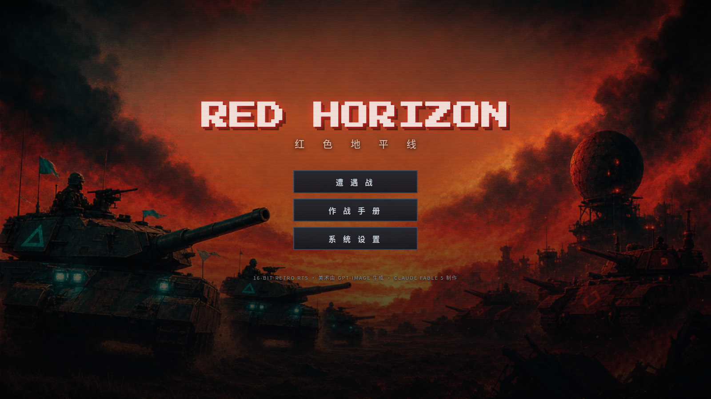
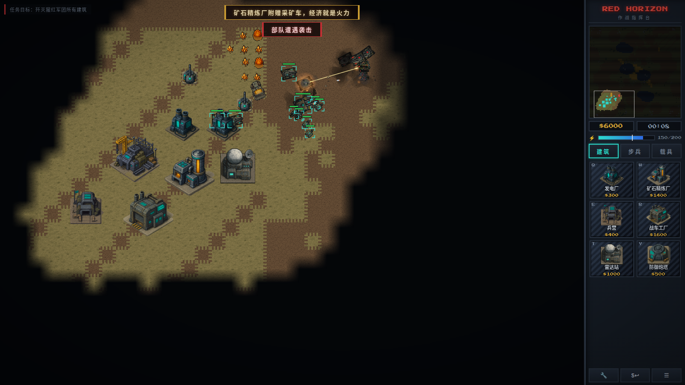
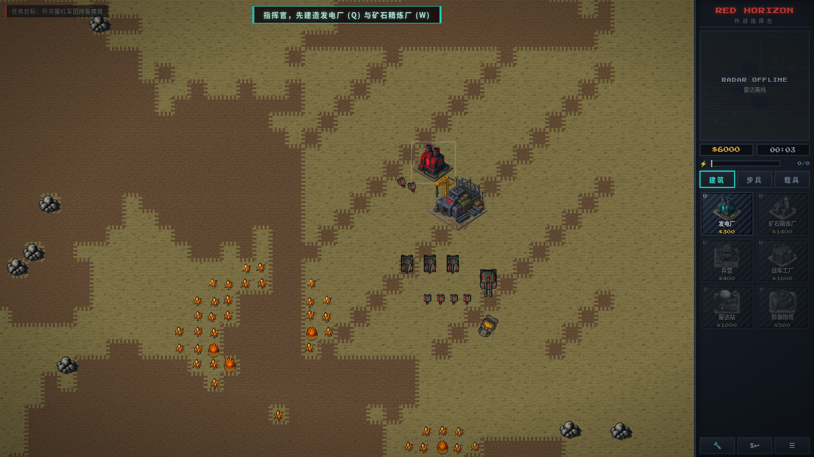

# RED HORIZON · 红色地平线

> 浏览器里的复古红警式即时战略。采矿、建造、指挥装甲洪流，碾碎猩红军团。

**▶ 立即游玩: https://claudetee.github.io/red-horizon/**



| 装甲对决 | 全局战场 |
|---|---|
|  |  |

## 这是什么

一场 Claude Fable 5 的能力边界测试：从零构建一款 **商业级精致度的复古 RTS 网页游戏**——
引擎、玩法、AI、音频全部手写，美术全部由 **gpt-image** 生成，零运行时依赖、零构建步骤、纯 ES Modules，
部署于 GitHub Pages。

## 特性

**玩法（经典红警循环）**
- 🏗️ **7 种建筑**：建造厂 / 发电厂 / 矿石精炼厂 / 兵营 / 战车工厂 / 雷达站 / 防御炮塔
- 🪖 **6 种单位**：步枪兵 / 火箭兵 / 侦察车 / 采矿车 / 中型坦克 / 猛犸重坦（车体与炮塔独立旋转）
- 💰 矿石经济：采矿车自动采集-运输-精炼，矿脉缓慢再生
- ⚡ 电力系统：断电时生产减速、雷达失效、炮塔射速减半
- 🕶️ 双层战争迷雾（探索/可见）+ 雷达小地图（需建雷达站且电力充足）
- 🤖 AI 对手：完整建造链、真实采矿经济、递增进攻波次、基地防御与重建，三档难度
- ⚔️ 克制关系：机枪克步兵，火箭克装甲，炮塔克载具

**手感与细节**
- 30tps 固定逻辑帧 + 渲染插值；A* 寻路 + 路径平滑 + 编队散布
- 曳光弹 / 抛物线炮弹 / 追踪火箭 + 炮口焰、后座、爆炸、残骸、弹坑、屏幕震动
- 框选 / 编队 (Ctrl+1~9) / 攻击移动 (A) / 警戒 (G) / 集结点 / 双击选同类
- 程序化 WebAudio 音效全套 + 自适应 chiptune 配乐（战斗时鼓组加密）+ 中文 EVA 语音播报
- CRT 扫描线、像素字体、自定义光标、维修/出售模式

## 操作

| 按键 | 功能 |
|---|---|
| 左键 / 拖拽 | 选择 / 框选 |
| 右键 | 移动 / 攻击 / 采矿 / 设集结点 |
| A + 左键 | 攻击移动 |
| S / G / H / Space | 停止 / 警戒 / 回基地 / 跳转战报 |
| Ctrl+1~9 → 1~9 | 编队 / 选编队（双击居中）|
| Q W E R T Y | 当前页签生产热键 |
| C / X | 维修 / 出售 |
| 滚轮 / 中键拖拽 / WASD / 屏幕边缘 | 缩放 / 平移 |

## 技术

- **引擎**: 手写 Canvas 2D，零依赖零构建，~5000 行 ES Modules
- **美术**: OpenRouter Images API（`openai/gpt-image-1` 生成 24 张 sprite/地形/keyart，`gpt-image-2` 生成标题海报），
  纯 Python 手写 PNG 编解码器做后处理（透明裁切 / alpha 加权缩放 / 中位切分调色板量化 / 描边 / FS 抖动）
- **敌军配色**: 运行时对青色识别像素做色相重映射（青 → 猩红），一套素材两个阵营
- **音频**: 全程序化合成——爆炸/枪炮/UI 由 WebAudio 节点图现场合成，配乐为 16 步进 chiptune 序列器
- **测试**: 自研 CDP 驱动（Node 内置 WebSocket 直连 headless Chromium），多 agent 自动化实战回归

美术由 AI 生成（gpt-image 系列）。像素字体 [Press Start 2P](https://fonts.google.com/specimen/Press+Start+2P)（OFL 协议）。

## 本地运行

```bash
python3 -m http.server 8123
# 打开 http://127.0.0.1:8123/
```

调试模式：URL 加 `?debug`（F2 资金 / F3 全图 / F4 快建 / F5 敌方波次 / F6 胜利 / F7 失败），`?seed=N` 固定地图。

---

*Built end-to-end by **Claude Fable 5** (Anthropic) — engine, gameplay, AI, audio, pipeline & deployment.*
